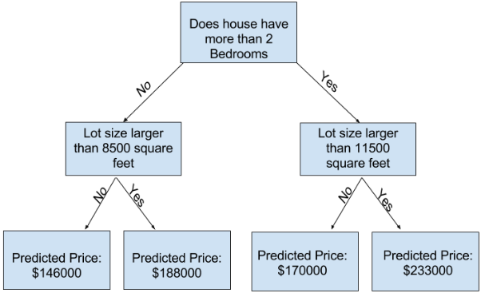
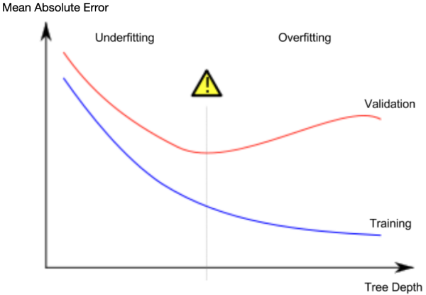

# Machine Learning

> ## inserir mais sobre contexto histórico

## Construção do Modelo

> dar mais detalhes gerais sobre o processo

A etapa de capturar padrões em dados chama-se _fitting_ ou treinamento - _training_ - de um modelo, os dados usados para se adequar ao modelo são chamados de dados de treino - _training data_.

### Familiarização com seus dados para o modelo

O primeiro passo em um projeto de ML é familiarizar-se com seus dados, podendo utilizar a função `.describe()` ou o método `.columns` para sua visualização, apesar deste método ser já um pouco "defasado"

Para uma melhor visualização, é preferível usar bibliotecas como **Skimpy** ou **SummaryTools**, com ambas gerando reports padronizados contendo tamanho do dataset, tipos de dados, dados faltantes, estatísticas resumidas, etc

- Skimpy:

```python
from skimpy import skim

skim(df)
```

- SummaryTools:

```python
from summarytools import dfSummary

dfSummary(df)
```

### Tratamento dos dados

#### Valores de tipos diferentes

> falar sobre tipos diferentes de dados, como int sendo str

#### Valores faltantes

Agora, com o conhecimento sobre os dados faltantes (NaN) e os tipos diferentes de dados, resta fazer a limpeza do seu dataset para a construção do modelo

Para a exclusão dos valores nulos, basta:

```python
melbourne_data.dropna(axis=0)
base = base.drop(eliminar, axis=1)  # ou aqui para eliminar somente as colunas com mais de 10% de valores nulos
```

Para a substituição dos valores nulos:

```python
base = base.fillna(-1)
```

#### Transformação de valores


Para esta introdução será usado o modelo de Árvore de Decisão, um modelo mais simples, mas, uma das melhores bases para modelos mais robustos

### Modelo de Árvore de Decisão - _Decision Tree_



Se uma casa tiver 2 quartos, preço previsto será $178.000, senão, $188.000

Para mais fatores, divide-se mais a árvore, formando árvores mais profundas - _deeper tree_

O ponto no final onde é feito uma predição é chamado de folha - _leaf_.


alvo da predição (prediction target) é uma coluna, salva como **Y** e características (features) serão as colunas que determinarão os preços do **Y**, elas serão o **X**

```python
y = melbourne_data.Price

melbourne_features = ['Rooms', 'Bathroom', 'Landsize', 'Lattitude', 'Longtitude']
X = melbourne_data[melbourne_features]
```


As etapas para criar um modelo são: 

- **Definir (Define)**: Que tipo de modelo será? alguns outros parâmetros serão especificados aqui
- **Padronizar (Fit)**: Capturar os padrões dos dados
- **Predizer (Predict)**: Isso aí mesmo
- **Avaliar (Evaluate)**: Determinar a acurácia 

```python
from sklearn.tree import DecisionTreeRegressor

# Definindo o modelo. Especificar o número no random_state assegura os mesmos resultados sempre
melbourne_model = DecisionTreeRegressor(random_state=1)

# Padronizando o modelo
melbourne_model.fit(X, y)

# Predizendo
melbourne_model.predict(X)
```

Acima, um modelo de Árvore de Decisão com scikit-learn


Medir a qualidade do modelo é a chave para melhorar seus modelos iteravelmente, para que seus dados sejam o mais próximo da realidade

O Erro Médio Absoluto (MAE): erro = realidade - previsto

```python
from sklearn.metrics import mean_absolute_error

predicted_home_prices = melbourne_model.predict(X)
mean_absolute_error(y, predicted_home_prices)
```


Uma boa prática é não treinar todos os dados de uma vez, mas separar em dados de teste e dados de validação

```python
from sklearn.model_selection import train_test_split

train_X, val_X, train_y, val_y = train_test_split(X, y, random_state = 0)

# Definindo o modelo
melbourne_model = DecisionTreeRegressor()  # aceita random_state=1
# Fit model
melbourne_model.fit(train_X, train_y)

# Retornando os preços previstos com os dados de validação
val_predictions = melbourne_model.predict(val_X)
print(mean_absolute_error(val_y, val_predictions))
```


**Overfitting**: Quando o modelo corresponde quase perfeitamente aos dados de treinamento mas é pobre na validação de outros dados, capturando padrões falhos que não ocorrerão no futuro, resultando em predições inacuradas 

**Underfitting**: Quando o modelo falha em capturar diferenças e padrões importantes , até nos dados de treinamento

Deve-se achar o meio termo entre o overfitting e o underfitting por meio da profundidade da árvore



O argumento `max_leaf_nodes` é uma boa maneira de fazer este controle

Quanto mais folhas são permitidas no nosso modelo, mais nos movemos da área de underfitting para a área de overfitting


```python
from sklearn.metrics import mean_absolute_error
from sklearn.tree import DecisionTreeRegressor

def get_mae(max_leaf_nodes, train_X, val_X, train_y, val_y):
    model = DecisionTreeRegressor(max_leaf_nodes=max_leaf_nodes, random_state=0)
    model.fit(train_X, train_y)
    preds_val = model.predict(val_X)
    mae = mean_absolute_error(val_y, preds_val)
    return(mae)

# Comparando o MAE com diferentes valores do max_leaf_nodes
for max_leaf_nodes in [5, 50, 500, 5000]:
    my_mae = get_mae(max_leaf_nodes, train_X, val_X, train_y, val_y)
    print("Max leaf nodes: %d  \t\t Mean Absolute Error:  %d" %(max_leaf_nodes, my_mae))
    
>>>
Max leaf nodes: 5  		 	 Mean Absolute Error:  347380
Max leaf nodes: 50  		 Mean Absolute Error:  258171
Max leaf nodes: 500  		 Mean Absolute Error:  243495
Max leaf nodes: 5000  		 Mean Absolute Error:  254983
```

> Snippet de código para selecionar a quantidade de folhas, com os dados separados da função `train_test_split()`

Dados de validação não são usados para treinamento de modelos, mas para medir a acurácia do modelo candidato

```python
# Lógica

scores = {leaf_size: get_mae(leaf_size, train_X, val_X, train_y, val_y) for leaf_size in candidate_max_leaf_nodes}

best_tree_size = min(scores, key=scores.get)

# adequar o modelo com best_tree_size
final_model = DecisionTreeRegressor(max_leaf_nodes=best_tree_size, random_state=1)

# Com a quantidade de folhas otimizada, usar no dataset inteiro
final_model.fit(X, y)

>>>
scores = {5: 35044.51299744237, 25: 29016.41319191076, 50: 27405.930473214907, 100: 27282.50803885739, 250: 27893.822225701646, 500: 29454.18598068598}
```


Uma árvore profunda com muitas folhas dará overfitting por que toda predição virá dos dados históricos das poucas casas como suas folhas. Mas, uma árvore rasa será incompleta pois não capturará as distinções dos dados

**Floresta Aleatória (Random Florest)**: Usa várias árvores, deixando na média as previsões de cada componente da árvore: `RandomForestRegressor()` 


## Referências
# machine-leaning-notes
# machine-leaning-notes
